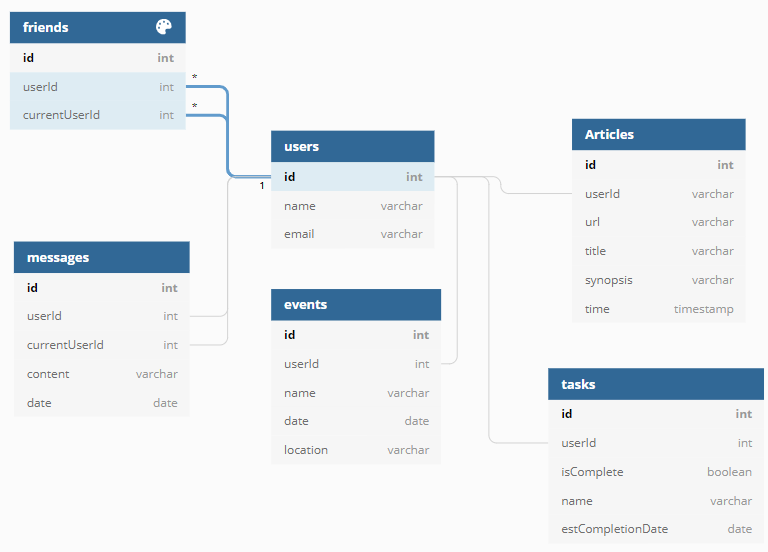

# Authors
- ### Micaela Colpi
- ### Joel Gage
- ### Bryson Goins
- ### B.J. Golden

# How To View
#### 1. Open your terminal / command line in put in ` git clone https://github.com/nss-day-cohort-47/reactive-nutshell-y2kids.git`
#### 2. Type `cd reactive-nutshell-y2kids`
#### 3. Type `npm start`
#### 4. Open a new terminal / command line and type `cd reactive-nutshell-y2kids` again.
#### 5. In this second terminal, type `json-server -p 8088 -w database.json`
#### 6. With both of these running, open a browser and go to `http://localhost:3000`. (This should have opened automatically a few seconds after you typed `npm start`)
#### 7. From this page, you should be able to explore our site as you would normally.

# Our ERD
